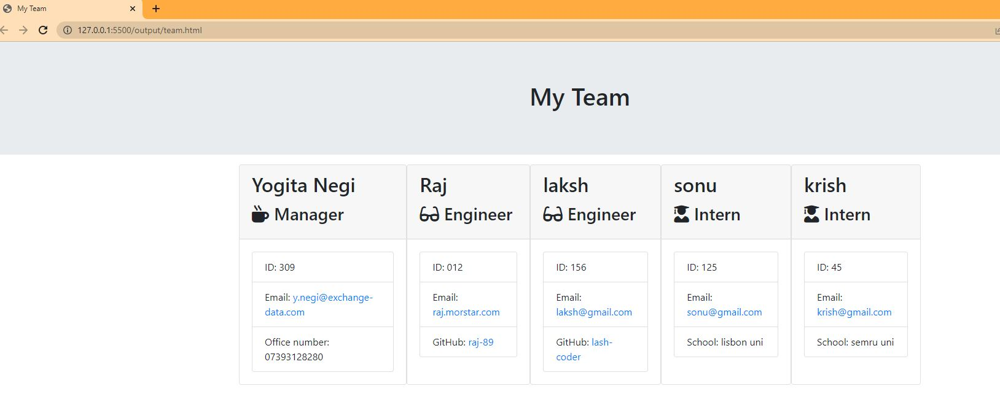
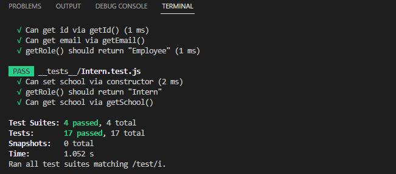

# Team Profile Generator

## Description

This is a Command line application that  will take in information about employees on a software engineering team, based on user input using the Inquirer module from Node.js and then generates an HTML webpage that displays summaries for each person. This project demonstrates use of OOP and TDD using Jest.

## User Story

As a manager I want  to generate a webpage that displays my team's basic info so that I have quick access to their emails and GitHub profiles.

## Acceptance Criteria

 ```Create a command-line application that accepts accepts user input .   

  When a user starts the application then they are prompted to enter the **team manager**’s:
      * Name
      * Employee ID
      * Email address
      * Office number
    * When a user enters those requirements then the user is presented with a menu with the option to:
      * Add an engineer
      * Add an intern 
      * Finish building the team
    * When a user selects the **engineer** option then a user is prompted to enter the following and then the user is taken back to the menu:
      * Engineer's Name
      * ID
      * Email
      * GitHub username
    * When a user selects the intern option then a user is prompted to enter the following and then the user is taken back to the menu:
      * Intern’s name
      * ID
      * Email
      * School
    * When a user decides to finish building their team then they exit the application, and the HTML is generated.

 Uses the [Inquirer package](https://www.npmjs.com/package/inquirer).

	* All tests passes using the Jest package: npm run test.

  * The application  have `Employee`, `Manager`, `Engineer`, and `Intern` classes.


```

## Screenshots

The following image shows a generated HTML’s appearance and functionality:



The following image shows a test run sample that all test passed:



screenshot of html generated


## Tests

run ```npm run  test``` to run Jest for tests on constructors

## Submission 

https://github.com/yogi-88/tdd-team-profile-generator


---
© 2023 edX Boot Camps LLC. Confidential and Proprietary. All Rights Reserved.
